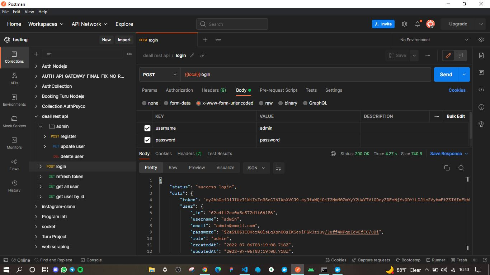

# Deall rest api

### [Link dokumentasi postman](https://documenter.getpostman.com/view/18883374/UzJHRy1x)

### [Link flowchart](https://drive.google.com/file/d/1kreuokSbGJp2a_6UB2TchwuMX8MCnA7R/view?usp=sharing)

### Credential admin

- username : admin
- password : password

### Command

- `docker build -t deall-rest-api:0.0.1 .`
- `docker network create deall-rest-api-network`
- `docker run -p 27017:27017 --network deall-rest-api-network -d --name mongo -t mongo:latest`
- `docker run -p 3000:3000 --network deall-rest-api-network -d deall-rest-api:0.0.1`
- `kubectl create -f pod.yaml`
- `kubectl port-forward deall-rest-api 3001:3000`

## Screenshoot

### <b>1. Buat container deall-rest-api</b>

### <b>2. Cek di docker desktop apakah container sudah terbuat</b>

### <b>3. Buat network lalu cek network</b>

### <b>4. Jalankan container deall-rest-api dan container mongodb</b>

### <b>5. Cek di docker desktop apakah semua container yang dibutuhkan sudah berjalan</b>

### <b>6. Cek apakah kedua container sudah terhubung di network yang sama</b>

### <b>7. REST API sudah berjalan di docker container</b>

